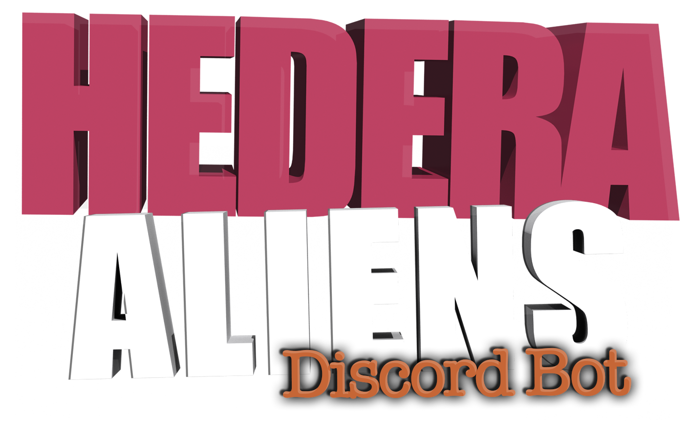
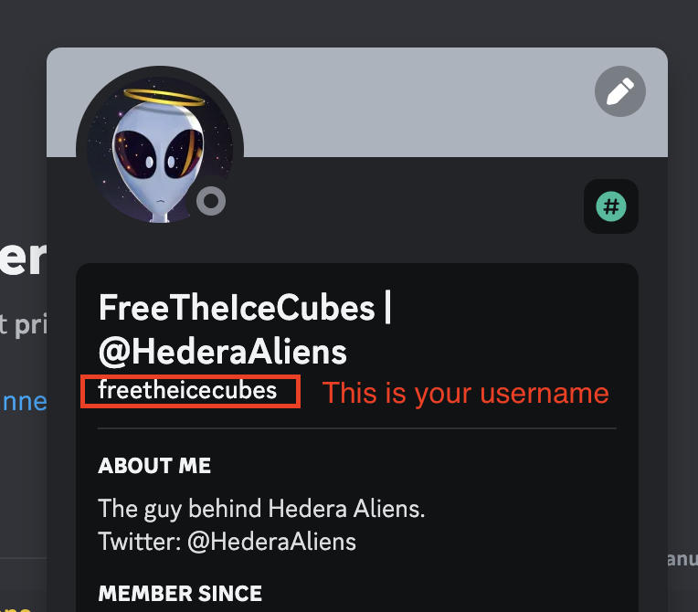
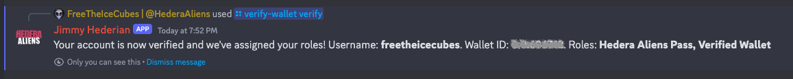
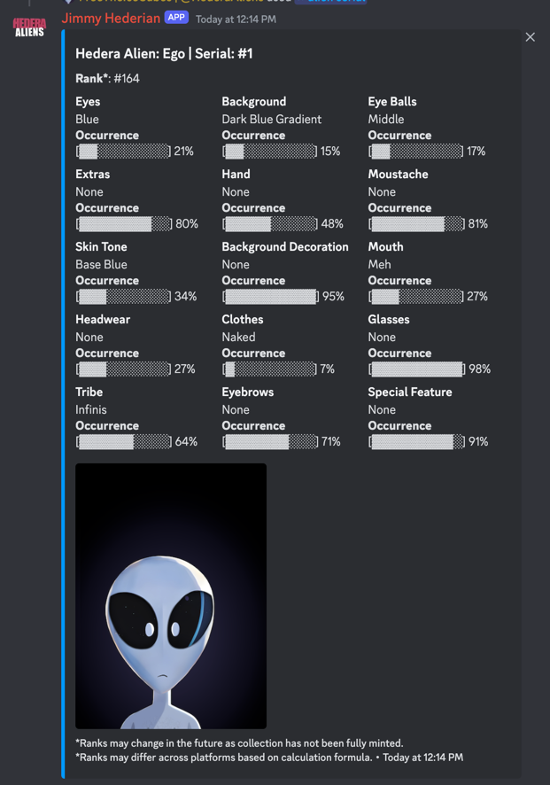
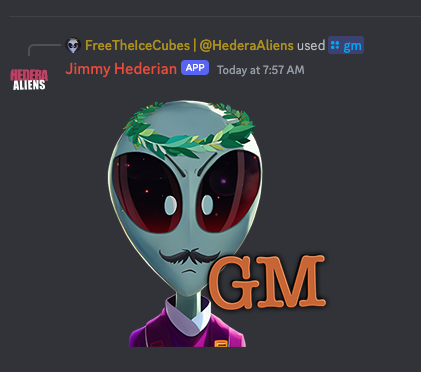
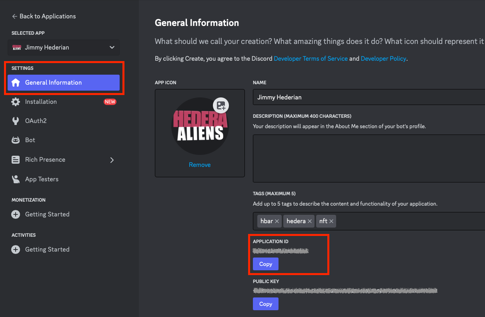
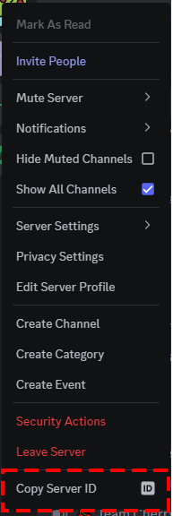

# Hedera Aliens Discord Bot


The Hedera Aliens Discord is a utility bot providing functionalities to empower Hedera communities and projects. The bot is written using JavaScript and is run on nodejs runtime.

## Functionalities
### Wallet verification
The wallet verification function provides the ability to automatically assign **Discord** roles based on token ids in users' wallet.
The function **does** not require any Hedera private keys, nor needs to interact with users' wallet using wallet connect or hash connect. For users to verify their wallet, they need to send a small amount of **0.01 HBAR** to specified HBAR wallet (you have control of that wallet) with memo containing their Discord **username**.
Once the transaction is made, users can verify their wallet using command: `/verify-wallet verify wallet-id:0.0.USER-WALLET-ID`.
The interaction with the bot is private. Only the interacting user will see the commands and replies, therefore, verification can be made in any channel.

Currently, the verification is a **one-time** event and the bot does not check whether the token id is still present in users' wallet afterward, unless they manually re-verify their wallet. The continuous role eligibility check is a [future improvement](#further-improvements-proposals).
The bot checks last 12 transactions in users' wallet for verification.

You can configure the bot to assign different token roles based on token id.





### NFT look up
Look up information about an NFT directly through the bot. The bot replies with an embed with information such as:
  - name, rank, traits and their distribution, image of the NFT

The NFTs can be looked up using either **serial id** (`/nft serial serial:123`) or **name** (`/nft name name:name-of-the-nft`).



### GM
A fun function that makes the bot reply with random GM image provided to the bot.
Usage: `/gm`



## Setup
The bot requires nodejs runtime environment. This can be your PC, a RaspberryPi or a server hosting. Generally, you want something that is online 24/7 for the bot to be available at all times.
The bot requires [nodejs](https://nodejs.org/en) runtime so be sure you have that available on the hosting. Please note, web-hosting typically **does not** have nodejs runtime.

**Steps**:
1. Create bot application. Follow this guide to set up the app with Discord: https://discordjs.guide/preparations/setting-up-a-bot-application.html#creating-your-bot
2. Checkout this repository to your filesystem.
3. Modify the bot configuration (see [Configuration](#configuration)).
4. Provide NFT collection information to the bot.
5. Register the commands with the Discord server (deploy-commands.js).
6. Run the bot (hedera-nft-bot.js)

## Configuration
The configuration file is located in `./_static/config.json`. Please note that the configuration file contains sensitive information in plaintext (Discord App private token), make sure you keep the file private.
You can use `./_static/config-example.json` as an example. Make sure you rename the example file to `config.json` after you edit it.
> !!! DO NOT PROVIDE THE CONFIG FILE TO ANYONE.

**Configuration** options:

- `token`: your private Discord app token. See https://discordjs.guide/preparations/setting-up-a-bot-application.html#what-is-a-token-anyway for more info.

- `clientId`: your application id from the [Discord developer portal](https://discord.com/developers/applications).



- `guildId`: id of your guild (Discord server ID). See: [Where can I find my server ID?](https://support.discord.com/hc/en-us/articles/206346498-Where-can-I-find-my-User-Server-Message-ID#h_01HRSTXPS5FSFA0VWMY2CKGZXA)



- `hederaRestApiUrl`: Address of Hedera network public mirror node. Typically: https://mainnet-public.mirrornode.hedera.com

- `validationWalletId`: Wallet ID to which the verification transaction should be sent to. See [Wallet verification](#wallet-verification) for details.

- `verifiedWalletRoleName`: Name of the Discord role to assign when wallet verification is successful. Please make sure the **exact** role name exists on the server.

- `sqliteDbPath`: Absolute system path to SQLite DB file containing information about the collection and wallet verifications.

- `tokenIdToDiscordRoles`: Mapping for Discord roles to token id as a list. Upon wallet verification roles in this configuration will be assigned to member if they hold the token id in their wallet. Please make sure your roles **exist** in your server.

### NFT collection information
The bot **does not** fetch information about the collection from Hedera network. The bot requires the information to be provided in JSON format on local filesystem. The file is located in: `./resources/nfts.json5`.
The format for the JSON5 file is:
- `serial`: (numeric) serial id of the NFT.
- `name`: (string) name of the NFT.
- `rank`: (numeric) rank within the collection #1 being the rarest.
- `traits`: (string) stringifed JSON list of following: 
  - `trait_type`: (string) name of the trait
  - `value`: (string) value of the trait
  - `occurence`: (decimal) percentage of trait occurrence in the collection in decimal form (0–1).

**Example**:
```
[
    {
    "serial": 14,
    "name": "Cosmo Joe",
    "rank": 1,
    "traits": '[{"trait_type":"Eyes","value":"Orange","occurrence":0.12},{"trait_type":"Background","value":"Space 3","occurrence":0.05},{"trait_type":"Eye Balls","value":"Half Eyes","occurrence":0.04},{"trait_type":"Extras","value":"None","occurrence":0.8},{"trait_type":"Hand","value":"Special Agent","occurrence":0.03},{"trait_type":"Moustache","value":"Style 1","occurrence":0.08},{"trait_type":"Skin Tone","value":"Base Blue","occurrence":0.34},{"trait_type":"Background Decoration","value":"GM","occurrence":0.04},{"trait_type":"Mouth","value":"Talking","occurrence":0.09},{"trait_type":"Headwear","value":"Snapback","occurrence":0.07},{"trait_type":"Clothes","value":"Space Suit","occurrence":0.12},{"trait_type":"Glasses","value":"None","occurrence":0.98},{"trait_type":"Tribe","value":"Infinis","occurrence":0.64},{"trait_type":"Eyebrows","value":"Angry","occurrence":0.07},{"trait_type":"Special Feature","value":"Animation Glitch","occurrence":0.01}]'
    },
    {
    "serial": 92,
    "name": "Marvin the Koalien",
    "rank": 2,
    "traits": '[{"trait_type":"Eyes","value":"Gravitational Lens","occurrence":0.32},{"trait_type":"Background","value":"Space 1","occurrence":0.12},{"trait_type":"Eye Balls","value":"Looking Up","occurrence":0.06},{"trait_type":"Extras","value":"Koala Nose","occurrence":0.03},{"trait_type":"Hand","value":"Sprout","occurrence":0.06},{"trait_type":"Moustache","value":"None","occurrence":0.81},{"trait_type":"Skin Tone","value":"Dark Green","occurrence":0.26},{"trait_type":"Background Decoration","value":"None","occurrence":0.95},{"trait_type":"Mouth","value":"Surprised","occurrence":0.01},{"trait_type":"Headwear","value":"Koala Ears","occurrence":0.04},{"trait_type":"Clothes","value":"Bear Costume","occurrence":0.04},{"trait_type":"Glasses","value":"None","occurrence":0.98},{"trait_type":"Tribe","value":"None","occurrence":0.04},{"trait_type":"Eyebrows","value":"Normal","occurrence":0.05},{"trait_type":"Special Feature","value":"Koala Klub","occurrence":0.03}]'
    }
]
```

The bot **does not** fetch NFT images from the IPFS, the images need to be provided locally on the filesystem. 
The location for the images on the filesystem is in: `./resouces/collection` folder.

The name of the files must match the serial id of the NFTs. For example, for serial number #1 the file needs to be named: 1.png or 0001.png. Leading zeros are acceptable. The bot currently expects only .png files.

### GM function
The images for the GM functions are located on local filesystem in: `./resouces/gm`. Files need to be in .png format and numbered such as 1.png, 2.png and so on.
Currently, there's a limitation of 6 GM images, that is bound to be changed in future update.

### Running the bot
On an environment with nodejs installed, use the following commands to run the bot:
- `node deploy-commands.js` Register the commands that the bot provides with Discord API.
- `node hedera-nft-bot.js` Run the bot.

We highly recommend using [pm2 process manager](https://pm2.keymetrics.io) for nodejs to run the bot and keeping it online.
We've tested the bot with node js v20.10 runtime.

## Known Limitations
Please be aware of the current limitations of the Hedera Aliens Discord bot, we provide this software without any warranty. The Software and code samples available in this repository are provided "AS-IS" without a warranty of any kind, either express or implied. **Use at your own risk.**

1. The bot does not contain continuous verification and validation for eligibility of the assigned Discord roles. Once a user verifies their wallet, they are assigned their roles, and this is a one-time event until they verify their wallet with the bot again.
2. The bot stores information about verifications, user discord usernames, and their wallet id in a local SQLite file. If, for whatever reason, that file is lost or becomes corrupt, so is the information in it. We highly recommend backing up the file regularly to **avoid significant** data loss.
3. The bot does not fetch data about the collection from the Hedera network but from local filesystem upon startup. The data about the collection is then loaded/queries from the SQLite file.

## Further improvements proposals
- Continuous check for eligibility of the assigned roles.
- Support for different RDBMS such as MySQL, PostgresSQL.
- Fetching NFT and caching information about the NFT collection directly from Hedera network and IPFS/Hashnials.
- Automated calculation of rarity score and trait distribution

## Contact
For contact, please head over to our Discord server. Please note we are doing this in our free time, and we may not be available for response at all times.

https://discord.com/invite/atsTv7dcZy

## License
The source files in this repository are made available under the [Apache License Version 2.0](./LICENSE.md).